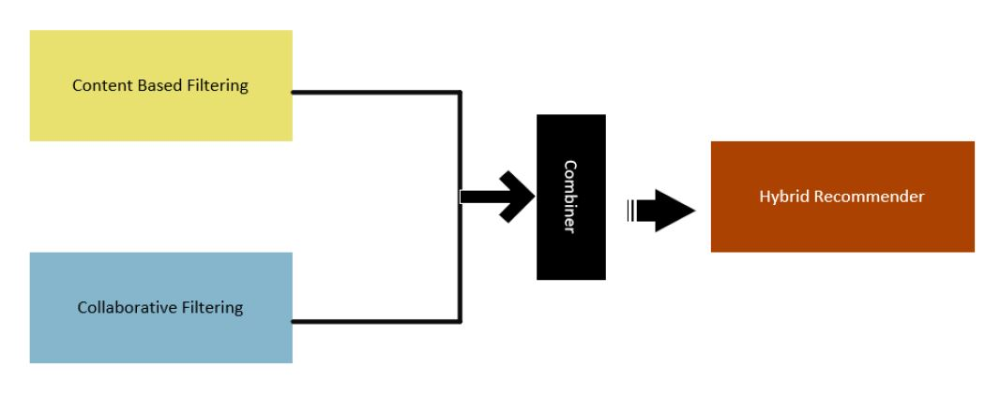

# Movie Recommendation System

A movie recommendation system was build to predict movies to users using content-based, collaborative and hybrid filtering on MovieLens 20K dataset.

- Implemented the recommender system using python libraries pandas, numpy, matplotlib, scipy and scikit-learn 
- Applied exploratory data analysis for visualizing data and investigating each component of the dataset
- Compared the performance of TF-IDF, KNN and SVD algorithms based on RMSE value

## Algorithms

Content-Based Filtering

- Term Frequency (TF) and Inverse Document Frequency (IDF)
- Cosine Similarity

Collaborative Filtering:

- K-nearest neighbors (KNN) Algorithm
- Singular Value Decomposition (SVD)

Hybrid Filtering

## Development Tools
- Anaconda
- Project Jupyter

## Programming Language 
- Python
